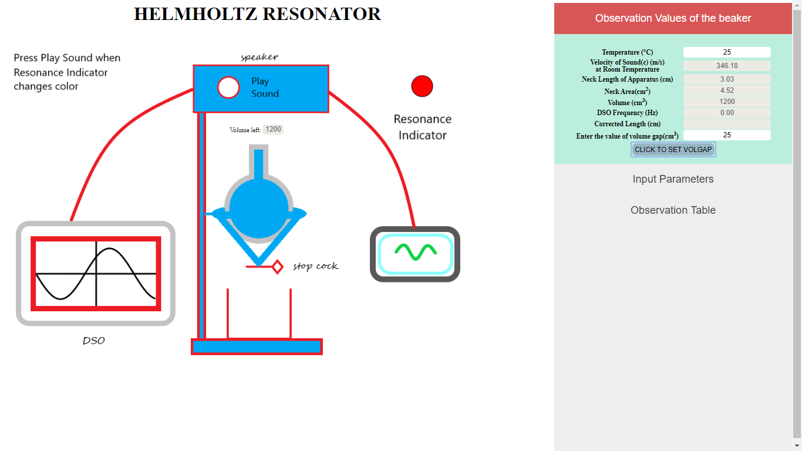

This folder has 
### Aim
To Illustrate the relationship of the resonant frequency with cavity volume of a Helmholtz resonator.
### Theory
Helmholtz Resonator is also called as Wind Throb. The original resonator was made up of Brass and spherical in shape and one can blow air from the cavity at the top of the resonator. The main aim of the resonator is to tune the base frequency with associated frequency to depress or to raise the sound. Helmholtz Resonator is frequently used as a musical instrument. The formula to find the natural and resonating frequency is...
				      f=(c/2π) √(A/VL)
### Procedure
1.Click on Neck , Area opening port and Volume of the cavity respectively.

2.Click on ‘OBSERVATION VALUES OF THE BEAKER’ and enter the values of Temperature and Volume in given units.Then Click on ‘CLICK TO SET VOLGAP’ button.

3.	Click on the stopcock to start the flow of water and then stop it after a certain time interval.

4. Click on Input parameter, enter the values of radius & length and then CALCULATE FREQUENCY. 

5. Now open the observation table and click on the ADD OBSERVATION. Then repeat step 3. And 5. 
    Alternately to take at least 14 observations.

6. Now open the PLOT GRAPH option and click on GET LENGTH to obtain the corrected values;
    Now you can obtain the graph by clicking on PLOT GRAPH.

### Pre Test

1.State the correct equation.
 a.ω=(k/m)^1/3
 b.ω=(k/m)1/2
 c.ω=(km)^1/2 
 d.ω=(m/k)

2.Resonance frequency is inversely proportional to
 a.√V 
 b.V 
 c.V^2 
 d.1/V  

3.Vibration of air in Helmholtz resonator can be considered analogous to 
 a.pulley- mass system
 b.spherical cavity
 c.spring-mass system 
 d.fluid pressure  

4.The expression of resonant frequency in a series resonant circuit is? 
 a.1/(2π√C) 
 b.1/( 2π√L)
 c.1/(2π√LC) 
 d.2π√LC 

### Post Test
For Learning Objective 1
1.	 Resonance will occur when the voltage V is
a) Maximum
b) Minimum
c) Zero
d)Can’t Say

For Learning Objective 2
2.	The expression of resonant frequency is?
a) (c/2π) √ (A/VL)
b) (c*2π) √ (A/VL)
c)both
d)none

For Learning Objective 3
3. 	A graph is obtained between
a) 1/√V vs. f
b) f  vs. 1/√V
c) 1/V vs. f
d) none

For Learning Objective 4
4.	 Which of the following waveform obtained in DSO?
a) square
b) triangle
c) sine
d) octagon

For Learning Objective 5
5.	 Mention the type of slope of the graph of 1/√V vs. f.
a. positive
b. negative
c. no slope found
d. Depends on the process

### References
https://en.wikipedia.org/wiki/Helmholtz_resonance

