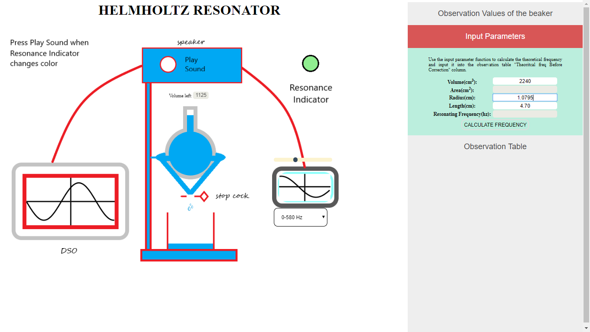

1.Click on Neck , Area opening port and Volume of the cavity respectively.

2.Click on ‘OBSERVATION VALUES OF THE BEAKER’ and enter the values of Temperature and Volume in given units.Then Click on ‘CLICK TO SET VOLGAP’ button.

3.	Click on the stopcock to start the flow of water and then stop it after a certain time interval.

4. Click on Input parameter, enter the values of radius & length and then CALCULATE FREQUENCY. 

5. Now open the observation table and click on the ADD OBSERVATION. Then repeat step 3. And 5. 
    Alternately to take at least 14 observations.

6. Now open the PLOT GRAPH option and click on GET LENGTH to obtain the corrected values;
    Now you can obtain the graph by clicking on PLOT GRAPH.
