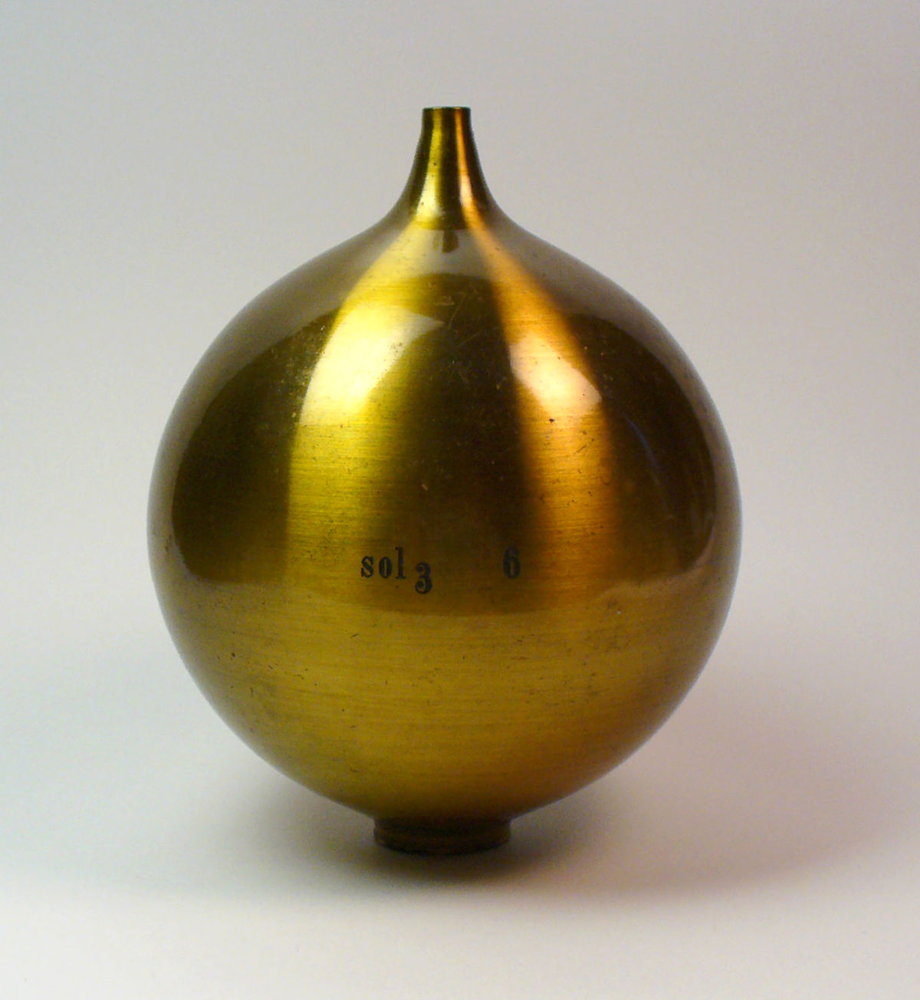

<justify>
Helmholtz resonator is a vessel with a narrow neck, as shown in Figure-1. 
If air is blown into it, the air in the neck gets compressed and expanded similar
to a spring and mass system. Instead, one can make the air in the neck portion to move
by the sound wave generated by placing a tuning fork above the neck. Similarly, the air
in the neck portion can be made to vibrate by a speaker placed near it generating sound wave.

The amplitude (loudness) of the sound produced depends on the neck length, cross-sectional area of the neck and volume of the resonator.
Helmholtz resonators do not work on the principle of formation of standing wave pattern.
Instead, they can be modelled as a simple mass loaded on a spring system.

The air in the neck acts as the mass, while the air pressure on both inside and out of the resonator acts as the spring.
The effective mass of the air in the neck is given by
m = ρ A L
where
ρ is the density of air
A is the neck area
L is the neck length
The air pressure acts as a spring in the system. The “spring constant” of the air pressure is given by
k = ρc 2AxA/V …3
where,
c is the velocity speed of sound in air
V is the volume of the cavity
A is the area of the neck
The resonator can be excited using a frequency generator and speaker tuned to the resonant frequency. This sound acts as a driving force, given by
F =PA …4
Where
P is the sound pressure.
The equation for spring mass oscillation can be written as
m d 2 δ/dt 2 + kδ = AP ….5
where
δ is the displacement of the slug of air contained in the neck.

Solving Equation-5, we get the resonance frequency as
ω 0 = √k/m ….6

Substituting for m and k in Equations- 1 and 3, we get
f = c/2∏ √A/VL …7
This shows that the resonance frequency is inversely proportional to the square root of the volume as predicted by Helmholtz.
A graph of 1/V versus f is a straight line. This equation is known as Helmholtz equation. Unknown volume of hidden resonator can,
therefore, be determined by knowing its resonance frequency and the neck dimensions.

The assumption of spring mass oscillation in the resonator is not perfectly valid in actual practice because the boundary
conditions at the two ends from where the sound wave enters into the resonator are different. Hence the theoretical frequency
does not match with the value give by Equaution-7. For this reason a correction needs to be applied to the neck length.
This correction factor can be estimated by performing the experiment. If L' is the corrected neck length, the equation for
frequency becomes
f = c/2∏ √A/VL’ …8

If a graph is drawn taking f on Y-axis and √(1/V) along X-axis, the straight line graph will have
slope (m expt ) given by
m expt = c/2∏ √A/L’ and the theoretical curve will have slope (m thet ) given by
(m expt / m thet ) = √L/L’

In this experiment employing a fixed neck resonator, its volume is varied by filling it with water and the corresponding resonance frequency is determined.
</justify>