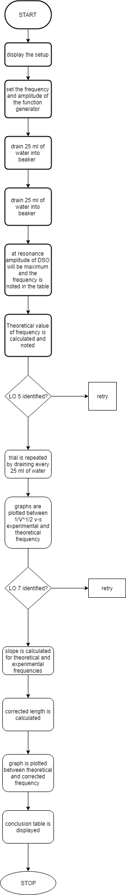
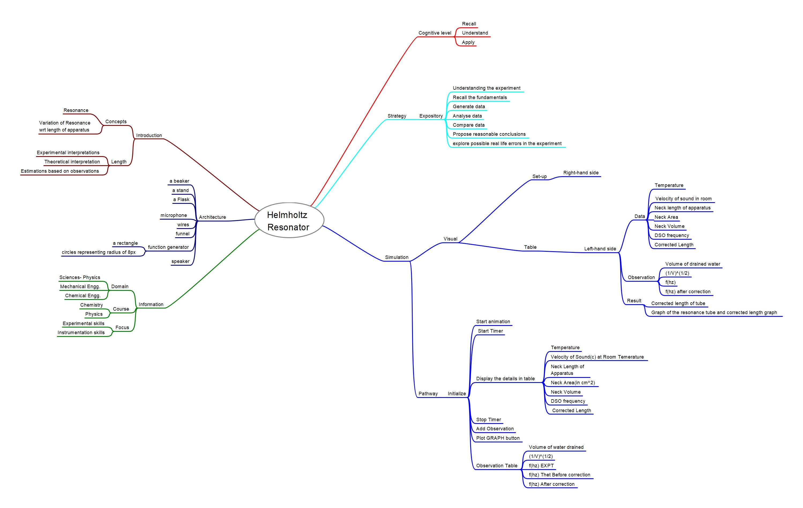

## Storyboard (Round 2)

Experiment 1: Name of the Experiment

### 1. Story Outline:

Helmholtz resonator is a vessel with a narrow neck. Neck dimensions like length, area, diameter and volume are determined. The speaker-microphone system is placed above the neck. The speaker is connected to the sine wave output of the function generator and a particular value of the frequency is set. The microphone is connected to the DSO. Speakers are switched on and sound is heard. Water is filled up to the brim of the separating funnel. Now 25 ml water is drained out through the funnel using a graduated beaker which creates 25 ml space in the separating funnel, so the resonator volume becomes 25 ml. the frequency of the function generator is increased from 100Hz hearing sound and watching the DSO. At the resonance frequency the sound will have the maximum amplitude and the DSO shows maximum amplitude. The resonance frequency is noted from the DSO. Theoretical frequency is also calculated using the given equation. Trial is repeated by draining out 25 ml water; making the volume of the resonator cavity to 50 ml and the resonance frequency is determined and recorded in table. The trial is repeated until all the water is drained out and the resonance frequency of empty funnel is determined (theoretical and experimental). A graph is plotted taking 1/V along X-axis and f on - axis which gives a straight line. It is seen that the theoretical curve passes through the origin 0, whereas the experimental curve does not pass through the origin. The slopes of the two curves are determined and the value of corrected neck length is obtained by putting their values in the formula. For empty resonator a certain value of resonance frequency is obtained which corresponds to a certain volume. This volume (experimental as well as actual) is noted in the conclusion table along with corrected neck length.

### 2. Story:

#### 2.1 Set the Visual Stage Description:
The setup will contain a lot of elements. Firstly we will keep a retort stand which is found in chemistry labs. There will be a circular clamp attached to it. On top of the retort stand we fix the speaker-microphone system. We fix the separating funnel in the circular clamp and keep a graduating beaker below it. The microphone is placed just above and at the center of the neck of the funnel. We will position the DSO and function generator on both sides of the retort stand. We connect the speaker to the sine wave output of the function generator and microphone to the DSO. A tap will be provided to fill the funnel with water. An observation table will be provided on the extreme right which we will simultaneously keep filling after transferring every 25 ml of water subsequently. Formula of frequency will be displayed below the table. The calculated frequency will be displayed in respective column after the user would click on CALCULATE button. When all the readings are obtained in the table, it will show the PLOT GRAPH button which would display the graph. Now the SLOPE button would appear. By clicking on it the value of both theoretical and experimental slopes would be obtained and recorded. Calculation for L’ will be displayed. All the data recorded will be displayed in the CONCLUSION table at the end.

#### 2.2 Set User Objectives & Goals:

1. Prime objective is to find the corrected neck length by performing the experiment.
2. Observe the wave pattern on the DSO for resonance.
3. Understanding the difference between theoretical and experimental resonance frequency and in turn find the corrected value of frequency.
4. See the difference between experimental and theoretical curves of 1/V^1/2 and f.
5. To memorize the formula of frequency and corrected length.

#### 2.3 Set the Pathway Activities:

1.	Fill water up to the brim in the separating funnel by clicking on the tap and put it in the circular clamp.
2.	Neck dimensions like length, area, volume and radius will be displayed.
3.	Connect the speaker with the function generator.
4.	Set the amplitude and frequency of the function generator so that corresponding sound is heard from the speaker.
5.	Connect the microphone with the DSO.
6.	Drain 25 ml of water into the graduated beaker kept below by clicking on the stop cock. Initial volume becomes 25 ml and is displayed in the table provided at the right.
7.	1/V^1/2 is displayed in the table.
8.	At the resonance frequency the amplitude at the DSO will be maximum and that particular is noted in the table as experimental frequency which has been displayed in the DSO screen.
9.	Display the theoretical value of frequency calculated by the formula as theoretical frequency in the table.
10.	Trial is repeated by draining 25 ml of water every time and data is filled subsequently in the table.
11.	 PLOT GRAPH button appears and graph of 1/V^1/2 v-s experimental as well theoretical frequency is plotted and displayed as two straight lines with different slopes.
12.	CALCULATE SLOPE button appears. By pressing which we obtain the values of theoretical and experimental slope. 
13.	On clicking the CALCULATE LENGTH button corrected length is displayed after calculation.
14.	Corrected theoretical frequency is calculated by using the corrected length obtained and displayed in the table.
15.	Click on the PLOT GRAPH button again and a graph between theoretical frequency and corrected one is plotted and displayed.
16.	For empty resonator the observed frequency is 276Hz which corresponds to V= 297ml.
17.	Conclusion table is displayed. 

##### 2.4 Set Challenges and Questions/Complexity/Variations in Questions:

1. A Helmholtz Resonator is needed at a frequency of 300 Hz. If t he neck will be 100 mm long and have a diameter of 50 mm, what volume will be needed for the resonator?
2. Applications of resonator?
3. State all the formulae used in the experiment.
4. Name the types of waveforms generated in a DSO.

##### 2.5 Allow pitfalls:

1.	The user can drain more than 25ml of water out of the funnel.
2.	The resonance frequency may not get noted by the user if he/she fails to see the waveform generated at the very precise time of resonance. 
3.	If user mistakenly selects triangular or any other waveform other than sine wave then the desired frequency will not be available.

##### 2.6 Conclusion:
After making the neck correction, the theoretical and experimental curves nearly match with each other with very small deviation (less than 7 %), thus verifying the Helmholtz equation. The accuracy of the volume determination of separating funnel is excellent. The resonator behaves better when its volume is more than 150ml, being half the actual volume (300ml) of the funnel. Because of this, an attempt has been made to determine the volume by filling the resonator with marbles, sand and other liquids. The volume determined by filling small marbles was not accurate may because of the air gap between the marbles.

##### 2.7 Equations/formulas: NA
Resonant frequency of the resonator(f)= c/2pi(A/VL)^1/2
Slope of the graph of 1/V^1/2 v-s f (m expt)= c/2pi(A/L)^1/2
Corrected length of the neck(L’)=(mthet/mexpt)^2L

### 3. Flowchart 4
 

### 4. Mindmap:

 
 
### 5. Storyboard :
Storyboard: <a href="storyboard/storyboard.gif"> [here]</a>
