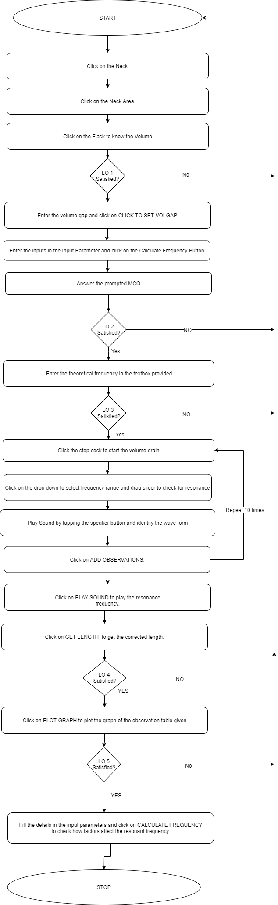

## Storyboard (Round 2)

Experiment 1: Helmholtz Resonator

### 1. Story Outline:

Helmholtz resonator is a flask with a narrow neck. Neck dimensions like length, area, diameter and volume are determined. The speaker-microphone system is placed above the neck. The speaker is connected to the sine wave output of the function generator and a particular value of the frequency is set. The microphone is connected to the DSO. Speakers are switched on and sound is heard. Water is already filled up to the brim of the separating funnel. Now 21 ml(default) water is drained out through the funnel using a graduated beaker which creates 21 ml cavity, so the resonator cavity volume becomes 21 ml. The frequency of the function generator is increased from 185Hz hearing sound and watching the DSO. At the resonant frequency, the sound will have the maximum amplitude and the DSO shows maximum amplitude. The resonance frequency is noted from the function generator. Theoretical frequency is also calculated using the given equation. Trial is repeated by draining out 21 ml water; making the volume of the resonator cavity to 42 ml i.e. twice of the volume gap and the resonant frequency is determined and recorded in table. The trial is repeated until all the water is drained out and the resonant frequency of empty flask is determined (theoretical and experimental). A graph is plotted taking 1/√V along X-axis and f on - axis which gives a straight line. It is seen that the theoretical curve passes through the origin, whereas the experimental curve does not pass through the origin showing the experimental errors. The slopes of the two curves are determined and the value of corrected neck length is obtained by putting their values in the formula. For empty resonator a certain value of resonant frequency is obtained which corresponds to a certain volume. This volume (experimental as well as actual) is noted in the conclusion table along with corrected neck length.

### 2. Story:

#### 2.1 Set the Visual Stage Description:
The setup will contain a number of elements. Firstly we will keep a retort stand with a circular clamp attached to it. On top of the retort stand we fix the speaker-microphone system. We fix the separating funnel in the circular clamp and keep a graduating beaker below it. The microphone is placed just above and at the center of the neck of the flask. We will position the DSO and function generator on both sides of the retort stand. We connect the speaker to the sine wave output of the function generator and microphone to the DSO. An observation table will be provided on the extreme right which we will simultaneously keep filling after transferring every 21 ml of water subsequently. Formula of frequency will be displayed through a pop-up on the screen. The calculated frequency will be displayed in respective column after the user would click on ADD OBSERVATION button. After taking all the necessary readings obtained from the table, click on the PLOT GRAPH button to display the graph showing experimental and theoretical graph lines based on the observation table. Now the SLOPE button would appear. By clicking on it the value of both theoretical and experimental slopes would be obtained and recorded. Calculation for ‘L’ will be displayed.

#### 2.2 Set User Objectives & Goals:

1. Prime objective is to find the corrected neck length by performing the experiment.
2. Observe the wave pattern on the DSO for resonance.
3. Understanding the difference between theoretical and experimental resonance frequency and in turn find the corrected value of frequency.
4. To identify the difference between experimental and theoretical curves of 1/√V and f.
5. To memorize the formula of frequency and corrected length.

#### 2.3 Set the Pathway Activities:

1. To start the experiment, the User will have to click on the respective parts of the setup to reveal the values in the observation values table.
2. Input the values of temperature and volume gap in the obervation values table and click on CLICK TO SET VOLGAP button.
3. Click on the stop cock to start and stop the flow of water from flask to the beaker.
4. Now, input the paramters into the "Input Parameters table and click on CALCULATE FREQUENCY to input the resonant frequency calculated by the user into a textbox after the user correctly identifies the formula driving the experiment.
5. Now use the dropdown menu to set the range of frequencies into the function generator and position the slider to check for resonance.
6. The Resonance indicator will turn green on resonance and the user can click on the Play Sound button to play the resonant frequency.
7. Repeat the obervations by clicking on ADD OBSERVATION button and repeat from step 5.
8. Go to Plot Graph panel and click on GET LENGTH to get the corrected length after the user inputs the correct slope value into the textbox.
9. Click on PLOT GRAPH button to generate a graph containing the graph of theoretical and experimental observations noted in the obseravtion table.

##### 2.4 Set Challenges and Questions/Complexity/Variations in Questions:

1. A Helmholtz Resonator is needed at a frequency of 300 Hz. If the neck will be 100 mm long and have a diameter of 50 mm, what volume will be needed for the resonator?
2. Which is the most dominant factor in changing the frequency?
3. State all the formulae used in the experiment.
4. What will happen to the frequency if the neck length is increased rapidly? (HOTS)

##### 2.5 Allow pitfalls:

1. If the volume is zero and user clicks on add observation, then an infinity error will be displayed in the observation table.
2. If the user tries to make the frequency more than 1600 Hz then it may harm his/her ears.

##### 2.6 Conclusion:
A congratulations message will pop-up for a user who has completed the practical by generating the final graph for the experiment, motivating him to perform it again using different volume intervals and parameters by using the custom input parameter function.

##### 2.7 Equations/formulas:
Resonant frequency of the resonator(f)= c/2&#960;√(A/VL) 
Slope of the graph of 1/V^1/2 v-s f (m expt)= c/2&#960;√(A/L) 
Corrected length of the neck(L’) = L + 1.7(R) where R is the radius of the neck 

### 3. Flowchart 4
 

### 4. Mindmap:

 
 
### 5. Storyboard :
Storyboard: <a href="storyboard/storyboard.gif"> [here]</a>
